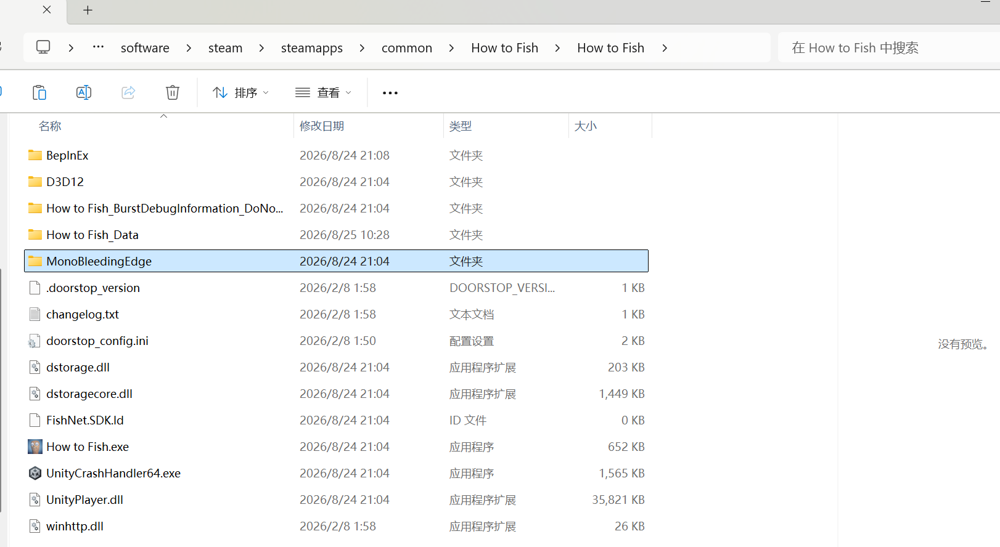
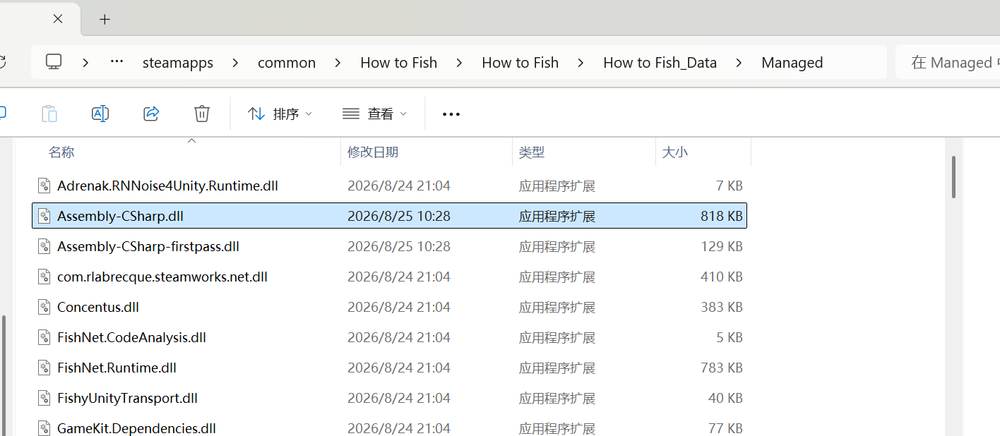
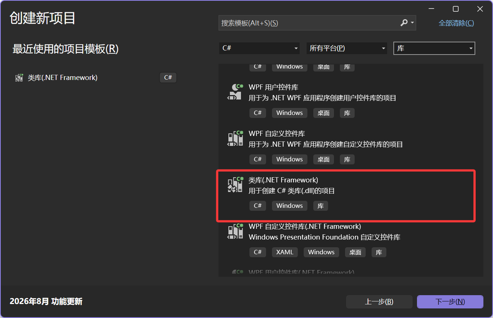
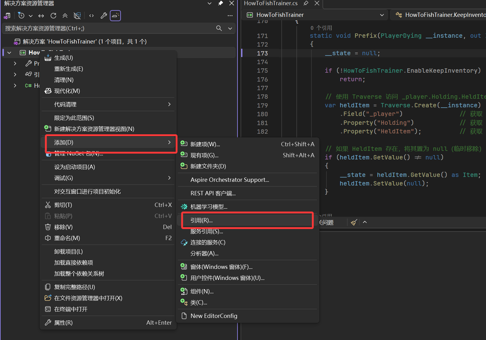
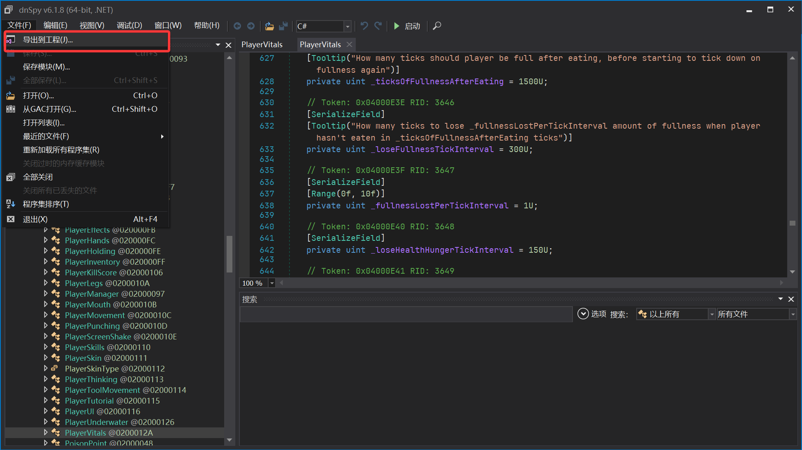
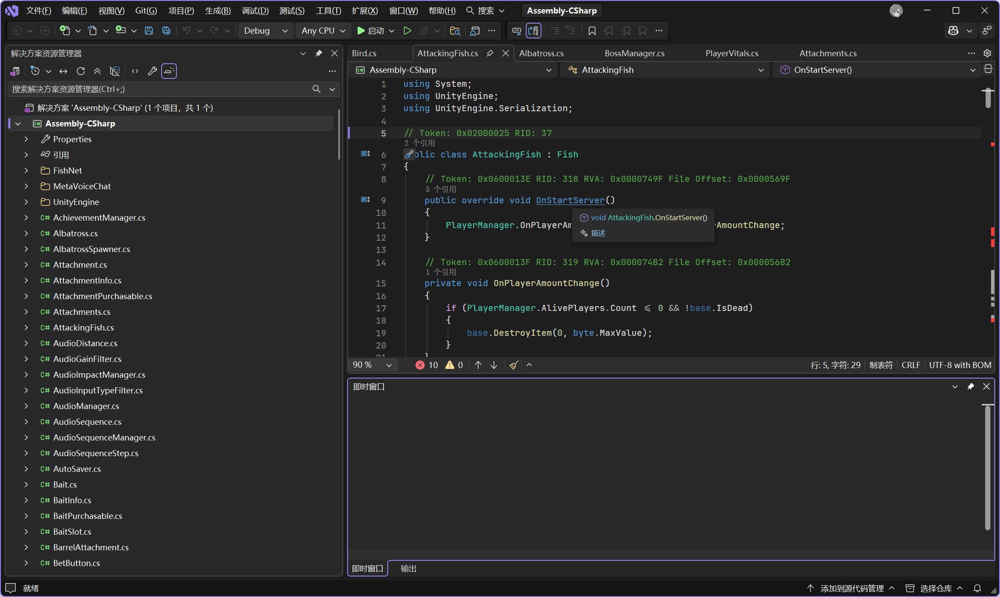
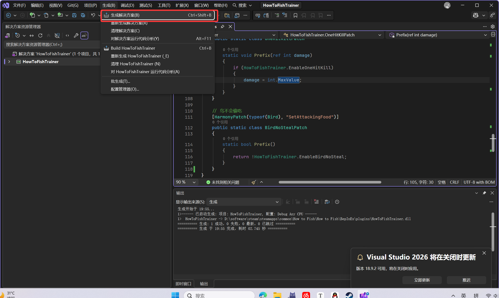

> [!NOTE]
>
> **适用于Mono后端的所有Unity引擎游戏**

因为被How to Fish的阴间魂游难度折磨的够呛, 写个修改器mod


根目录下有MonoBleedingEdge文件夹

同时How to Fish\How to Fish_Data\Managed下可以看到Assembly-CSharp.dll

即游戏是Mono后端






相反, 如果找不到如上文件, 并且能看到GameAssembly.dll与il2cpp_data等文件, 则是IL2CPP后端


> [!NOTE]
>
> Mono后端, 类似于Java, C#源码先编译为IL中间语言, 运行时由Mono虚拟机实时翻译为机器码
>
> ```
> C# 源码 → C# 编译器 → IL → Mono VM 在目标平台上 JIT 编译执行
> ```
>
> 另一种后端为IL2CPP, build时就全部转换为C++, 再编译
>
> ```
> C# 源码 → C# 编译器 → IL → IL2CPP 转换器 → C++ 代码 → 目标平台 C++ 编译器 → 原生机器码
> ```

Mono后端的mod开发要相对容易的多, 可以使用Harmony库直接hook原始C#方法


下载[BepInEx]([BepInBuilds - BepInEx Bleeding Edge](https://builds.bepinex.dev/projects/bepinex_be)), 一个Unity游戏插件框架, 解压到游戏根目录, 然后启动一次游戏以生成BepInEx所需的配置文件.

使用Visual Studio创建一个类库(.NET Framework)项目



添加dll引用, 以便于我们hook原方法与使用Harmony库



必须的引用有:

- `BepInEx.dll`（位于 `BepInEx\core`）
- `0Harmony.dll`（位于 `BepInEx\core`）
- `Assembly-CSharp.dll`（游戏目录的 `GameName_Data\Managed`）

其他可以根据mod具体的情况来添加


框架如下, namespace, mod名, GUID什么的可以自己改:

```c#
using BepInEx;
using HarmonyLib;
using UnityEngine;

namespace MyTrainerMod
{
    // 插件入口，必须继承 BaseUnityPlugin
    [BepInPlugin("com.yourname.mytrainermod", "My Trainer Mod", "1.0.0")]
    public class MyTrainerMod : BaseUnityPlugin
    {
        // 插件启动时调用
        private void Awake()
        {
            // 创建 Harmony 实例并应用所有补丁
            var harmony = new Harmony("com.yourname.mytrainermod");
            harmony.PatchAll();
        }
    }
}
```


为了实现修改器, 我们需要hook游戏的一些方法, 但是问题是现在这些C#代码全部已经编译为了IL中间代码在Assembly-CSharp.dll中, 为此, 我们需要[dnSpy](https://github.com/dnSpy/dnSpy/releases)反编译


使用dnSpy打开Assembly-CSharp.dll, 然后"文件-导出到工程"即可获得.sln文件, 即游戏源代码




使用Visual Studio打开即可



真棒啊, 但是最好不要把源代码公开到网上, 只公开你制作的mod即可


接下来便是正式的制作过程了, 也是比较无聊的过程.

比如说, 为了制作"无敌"mod, 我们需要hook源代码中人物受到伤害的代码, 为了制作加钱mod, 需要hook给人物加钱的代码.

而找这个方法的过程通常是比较繁琐的, 尤其在作者的程序架构不是那么清晰时.


在MoneyManager.cs类中我们看到了这个方法:

```c#
public static void SellItem(Item item)
{
    if (!MoneyManager.Instance || !MoneyManager.Instance.IsServerInitialized)
    {
        return;
    }
    MoneyManager.Instance._money.Value += item.TotalWorth;
    MoneyManager.Instance.ObserverMoneySound(true, item.LastHolder);
    MoneyManager.Instance.MoneySound(true, item.LastHolder);
}
```

很显然, 这就是售卖物品时加钱的方法, 我们只需要使用Harmony库hook这个方法即可实现得到大量的钱

```c#
[HarmonyPatch(typeof(MoneyManager), "SellItem")]
public class MoneyPatch
{
    static void Prefix()
    {
        if (MoneyManager.Instance && MoneyManager.Instance.IsServerInitialized)
        {
            MoneyManager.Instance._money.Value += 9999999;
        }
    }
}
```


> [!NOTE]
>
> Prefix即在方法执行前, 先执行hook方法, 除非Prefix方法返回false, 否则原方法仍然会执行
>
> Harmony库的细节可以参考[文档](https://harmony.pardeike.net/articles/intro.html)


其他的功能是同理的, 如"无敌":

```c#
[HarmonyPatch(typeof(PlayerVitals), "TakeDamage")]
public class DamagePatch
{
    static bool Prefix()
    {
        return false;
    }
}
```


这些功能是自动生效的, 如果想要制作开关, 可以写一个前端, 这里我为了方便直接用了OnGUI, 最终代码如下

```c#
using BepInEx;
using HarmonyLib;
using UnityEngine;

namespace HowToFishTrainer
{
    [BepInPlugin("com.mayuri.howtofishtrainer", "How To Fish Trainer", "1.0.0")]
    public class HowToFishTrainer : BaseUnityPlugin
    {
        // ===== 功能开关 =====
        public static bool EnableSellMoney = false;
        public static bool EnableNoHunger = false;
        public static bool EnableGodMode = false;
        public static bool EnableOneHitKill = false;
        public static bool EnableBirdNoSteal = false;

        // ===== UI 相关 =====
        private bool showMenu = false;
        private Rect windowRect = new Rect(20, 20, 500, 400);

        private void Awake()
        {
            var harmony = new Harmony("com.mayuri.howtofishtrainer");
            harmony.PatchAll();
        }

        private void Update()
        {
            // 按 F1 显示/隐藏菜单
            if (UnityEngine.Input.GetKeyDown(KeyCode.F1))
            {
                showMenu = !showMenu;
            }
        }

        private void OnGUI()
        {
            if (!showMenu) return;

            // 绘制一个可拖动的窗口
            windowRect = GUI.Window(0, windowRect, DrawMenu, "How To Fish Trainer");
        }

        private void DrawMenu(int windowID)
        {
            // 功能复选框
            EnableSellMoney = GUI.Toggle(new Rect(30, 50, 300, 40), EnableSellMoney, "售卖物品加更多钱");
            EnableNoHunger = GUI.Toggle(new Rect(30, 90, 300, 40), EnableNoHunger, "不掉饱食度");
            EnableGodMode = GUI.Toggle(new Rect(30, 130, 300, 40), EnableGodMode, "无敌");
            EnableOneHitKill = GUI.Toggle(new Rect(30, 170, 300, 40), EnableOneHitKill, "一击必杀");
            EnableBirdNoSteal = GUI.Toggle(new Rect(30, 210, 300, 40), EnableBirdNoSteal, "鸟不会偷吃");

            // 允许拖动窗口（标题栏区域）
            GUI.DragWindow(new Rect(0, 0, 500, 20));
        }
    }

    // ==================== 补丁部分 ====================

    // 售卖物品加钱钱钱钱钱
    [HarmonyPatch(typeof(MoneyManager), "SellItem")]
    public class MoneyPatch
    {
        static void Prefix()
        {
            // 开关关闭则直接返回，不额外加钱
            if (!HowToFishTrainer.EnableSellMoney) return;

            if (MoneyManager.Instance && MoneyManager.Instance.IsServerInitialized)
            {
                MoneyManager.Instance._money.Value += 9999999;
            }
        }
    }

    // 不掉饱食度
    [HarmonyPatch(typeof(PlayerVitals), "LowerFullnessTick")]
    public class FullnessPatch
    {
        static bool Prefix()
        {
            // 开启时返回 false，跳过原方法；关闭时执行原方法
            return !HowToFishTrainer.EnableNoHunger;
        }
    }

    // 无敌
    [HarmonyPatch(typeof(PlayerVitals), "TakeDamage")]
    public class DamagePatch
    {
        static bool Prefix()
        {
            return !HowToFishTrainer.EnableGodMode;
        }
    }

    // 一击必杀
    [HarmonyPatch(typeof(Creature), "LocalHit")]
    public static class OneHitKillPatch
    {
        static void Prefix(ref int damage)
        {
            if (HowToFishTrainer.EnableOneHitKill)
            {
                damage = int.MaxValue;
            }
        }
    }

    // 鸟不会偷吃
    [HarmonyPatch(typeof(Bird), "SetAttackingFood")]
    public static class BirdNoStealPatch
    {
        static bool Prefix()
        {
            return !HowToFishTrainer.EnableBirdNoSteal;
        }
    }
}
```


最后生成解决方案:


记得把输出目录中生成的dll文件复制到游戏目录的 `BepInEx\plugins`中


如果你的mod比较大型, 可以考虑制作Thunderstone包, 但是这里只是个小修改器所以算了(

将BepInEx解压到空文件夹, 在BepInEx\plugins中放入你的dll, 重新打包为zip就可以分发了, 让别人解压到游戏根目录即可

